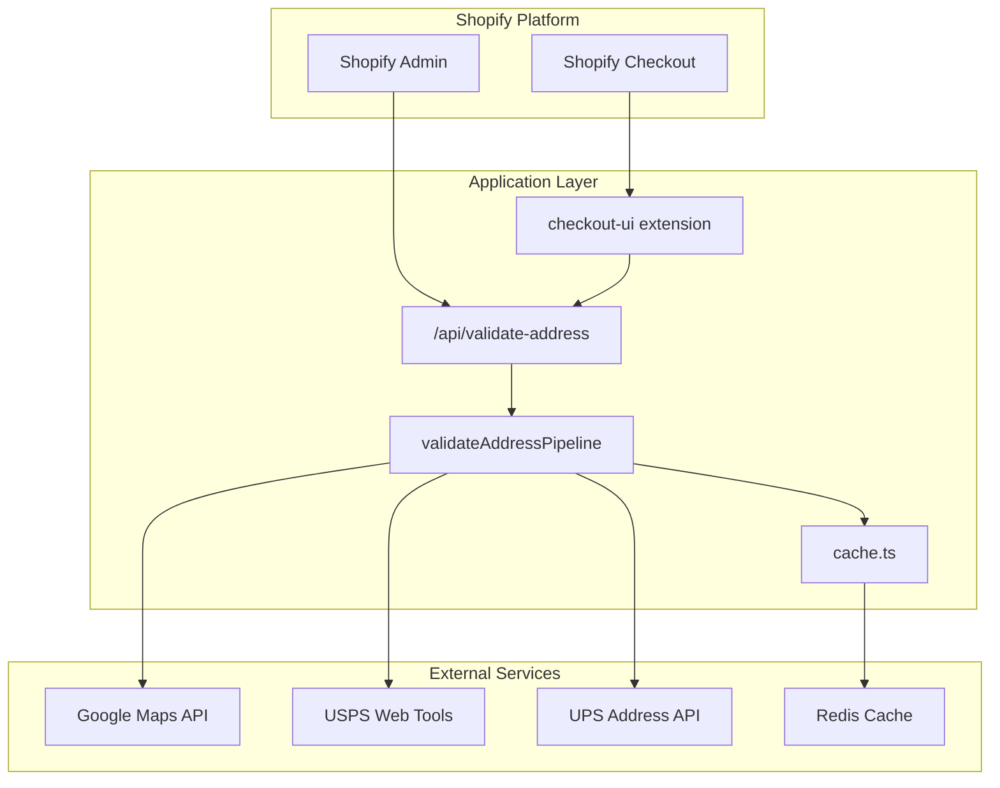
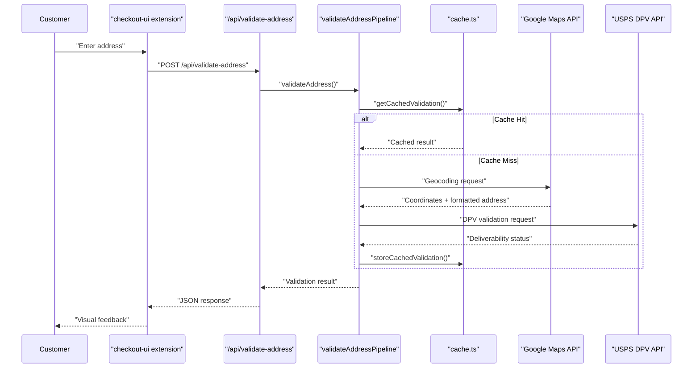

## Project Overview
The `Address Validator++` project is a Shopify app designed to validate, correct, and enforce customer shipping addresses during checkout. Its primary goal is to minimize failed deliveries, reduce merchant costs, and improve buyer confidence by using Google Maps and USPS/UPS DPV APIs. Key use cases include real-time address validation during checkout, visual confirmation of addresses, and blocking invalid addresses. The target audience is primarily US-based Shopify merchants, ranging from SMBs to mid-size DTC brands, particularly those experiencing recurring delivery errors.

## Current Implementation Status
The project is currently in the early implementation phase with the basic Shopify Remix template structure in place. Most core implementation files are scaffolded but contain only TODO comments requiring full implementation:
- ✅ Project foundation established (Shopify Remix template)
- ✅ Memory bank documentation created and updated
- ⚠️ Core validation logic not yet implemented (empty TODO files)
- ⚠️ External API integrations pending (empty TODO files)
- ⚠️ Checkout UI extension needs implementation (empty TODO files)

## Architecture & Structure
### High-level Architecture Overview
The `Address Validator++` system follows a layered architecture with distinct Shopify integration, application logic, and external service integration layers. The core of the system is a multi-stage validation pipeline that processes addresses through sequential validation stages, incorporating caching and fallback mechanisms.

### Key Directories and Their Purposes
The main application components are organized within the `app/` directory, with extensions located in the `extensions/` directory.
*   `app/`: Contains the main application logic, including `routes/` for API endpoints and `lib/` for core libraries.
*   `extensions/checkout-ui/`: Houses the Shopify Checkout UI extension, including its entry point `src/index.tsx`.
*   `app/lib/`: Contains core libraries such as `validateAddressPipeline.ts`, `google.ts`, and `cache.ts`.

### Main Components and How They Interact
*   **`checkout-ui` extension**: The user interface component that integrates with Shopify Checkout. It communicates with the `/api/validate-address` endpoint.
*   `/api/validate-address` **endpoint**: The primary API endpoint for address validation. It orchestrates business logic and interacts with the `validateAddressPipeline`.
*   `validateAddressPipeline.ts`: Contains the core address validation rules and logic, integrating with external services like Google Maps, USPS, and UPS.
*   `cache.ts`: Manages the caching layer, interacting with Redis for persistent caching.

### Data Flow and System Design
The core address validation flow begins with the customer entering an address in the `checkout-ui` extension. This triggers a POST request to `/api/validate-address`. The API then calls the `validateAddressPipeline`, which first checks the cache (`cache.ts`). If not cached, the pipeline proceeds with Google Maps for geocoding and USPS/UPS for DPV validation. The result is then cached and returned to the extension for visual feedback.

## Development Setup
### Prerequisites and Dependencies
To set up the development environment, you need:
1.  Node.js (v18.20 or v20.10+ recommended) 
2.  Shopify Partner Account 
3.  Development Store or Shopify Plus sandbox 
4.  API credentials for Google Maps, USPS, and UPS 
5.  Docker (optional, for containerized deployment) 

### Installation Steps
The project uses the Shopify Remix App Template. While specific installation steps are not detailed, the general process for a Remix app would involve cloning the repository and installing Node.js dependencies.

### Environment Configuration
Environment variables are crucial for configuring the application, especially for API keys.
Required environment variables include:
*   `SHOPIFY_API_KEY` 
*   `SHOPIFY_API_SECRET` 
*   `SCOPES` 
*   `HOST` 
*   `GOOGLE_MAPS_API_KEY` 
*   `USPS_USERNAME` 
*   `UPS_ACCESS_LICENSE_NUMBER` 
*   `UPS_USER_ID` 
*   `UPS_PASSWORD` 

### How to Run the Project Locally
The project uses Shopify CLI for local testing and development. Specific commands are not provided, but typically involve `shopify app dev` or similar commands to start the development server and tunnel.

## Code Organization
### Coding Standards and Conventions
The project emphasizes a "validation-first" approach, prioritizing address accuracy. Key philosophies include prevention over correction, transparency, performance with prudence, and merchant empowerment.
Technical patterns include:
*   **Validation Pipeline Architecture**: Multi-stage validation (Syntax → Cache → Google Maps → USPS/UPS).
*   **Error Handling Standards**: User-friendly messages, detailed logging, retry logic, and fallback responses.
*   **Performance Optimization**: Caching TTL (30 days for valid, 1 hour for failed), batch processing, asynchronous operations, and memory efficiency.
*   **API Integration Patterns**: Specific guidelines for Google Maps (environment variables for keys, component-based geocoding) and USPS/UPS (authoritative source, DPV requirements).
*   **Shopify Extension Patterns**: Minimal UI impact, real-time validation with debounce, visual confirmation, and error prevention for Checkout UI extensions. Polaris components for Admin Panel integration.

ESLint and Prettier are used for code quality and formatting.

### File Naming Patterns
Specific file naming patterns are not explicitly detailed, but based on the codebase context, files are named descriptively, e.g., `validateAddressPipeline.ts`, `google.ts`, `cache.ts`.

### Import/Export Patterns
The project uses TypeScript, implying standard ES module import/export patterns.

### Component Structure
Shopify Checkout UI Extensions follow a component-based architecture, with `extensions/checkout-ui/src/index.tsx` as the entry point for UI components and API communication. React is used for frontend components.

## Key Features & Implementation
### Main Features and How They're Implemented
The main feature is real-time address validation during Shopify checkout. This is implemented through a multi-stage validation pipeline:
1.  **Syntax Validation**: Basic format checking.
2.  **Cache Check**: Fast lookup for previously validated addresses.
3.  **Google Maps Validation**: Geocoding and coordinate validation.
4.  **USPS/UPS DPV Validation**: Authoritative postal deliverability check.
5.  **Result Aggregation**: Combines results for a final decision.

### Important Algorithms or Business Logic
The core business logic resides in the `validateAddressPipeline.ts` file. It orchestrates the calls to various validation services and manages caching. A graceful degradation pattern is implemented, allowing validation stages to operate independently if previous stages fail.

### API Endpoints
The primary API endpoint is `POST /api/validate-address` <cite repo="TudorCB/address-validator-gpt" path="memory-bank/systemPatterns.md

## Development Partnership and How We Should Partner

We build production code together. I handle implementation details while you guide architecture and catch complexity early.

## Core Workflow: Research → Plan → Implement → Validate

**Start every feature with:** "Let me research the codebase and create a plan before implementing."

1. **Research** - Understand existing patterns and architecture
2. **Plan** - Propose approach and verify with you
3. **Implement** - Build with tests and error handling
4. **Validate** - ALWAYS run formatters, linters, and tests after implementation

## Current Priority: Core Implementation
The immediate focus is on implementing the core validation functionality:
1. **Validation Pipeline** - Implement `app/lib/validateAddressPipeline.ts` with multi-stage validation logic
2. **External API Integrations** - Complete `app/lib/google.ts`, `app/lib/cache.ts` with proper error handling
3. **API Endpoint** - Implement `app/routes/api/validate-address.ts` with proper validation integration
4. **Checkout Extension** - Implement `extensions/checkout-ui/src/index.tsx` and `ui.tsx` components

## Code Organization

**Keep functions small and focused:**
- If you need comments to explain sections, split into functions
- Group related functionality into clear packages
- Prefer many small files over few large ones

## Architecture Principles

**This is always a feature branch:**
- Delete old code completely - no deprecation needed
- No "removed code" or "added this line" comments - just do it

**Prefer explicit over implicit:**
- Clear function names over clever abstractions
- Obvious data flow over hidden magic
- Direct dependencies over service locators

## Maximize Efficiency

**Parallel operations:** Run multiple searches, reads, and greps in single messages
**Multiple agents:** Split complex tasks - one for tests, one for implementation
**Batch similar work:** Group related file edits together

## Problem Solving

**When stuck:** Stop. The simple solution is usually correct.

**When uncertain:** "Let me ultrathink about this architecture."

**When choosing:** "I see approach A (simple) vs B (flexible). Which do you prefer?"

Your redirects prevent over-engineering. When uncertain about implementation, stop and ask for guidance.

## Testing Strategy

**Match testing approach to code complexity:**
- Complex business logic: Write tests first (TDD)
- Simple CRUD operations: Write code first, then tests
- Hot paths: Add benchmarks after implementation

**Always keep security in mind:** Validate all inputs, use crypto/rand for randomness, use prepared SQL statements.

**Performance rule:** Measure before optimizing. No guessing.

## Progress Tracking

- **Use Todo lists** for task management
- **Clear naming** in all code

Focus on maintainable solutions over clever abstractions.

---
Generated using [Sidekick Dev]({REPO_URL}), your coding agent sidekick.
